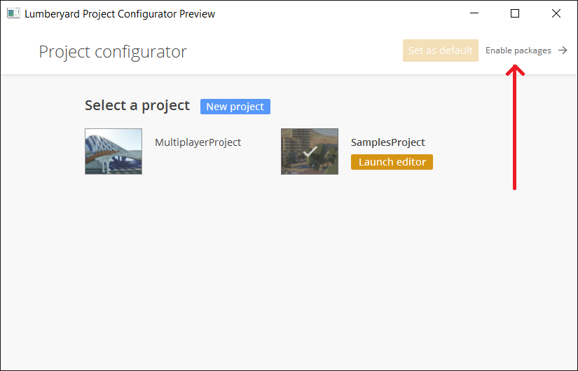
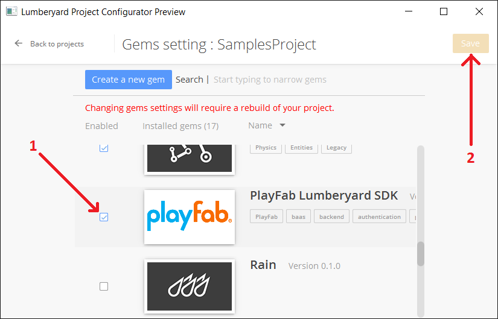

PlayFab Amazon Lumberyard SDK README
========
Welcome to the PlayFab Amazon Lumberyard SDK.


1. Overview:
----
This document describes the PlayFabSdk Lumberyard Gem, and usage.

The Lumberyard SDK will give you the ability to call any public PlayFab API from a Lumberyard project.

The PlayFab platform runs on AWS, and PlayFab has express permission from Amazon to provide services for Lumberyard.


2. Prerequisites:
----
* Install Lumberyard: https://aws.amazon.com/lumberyard/downloads/
 * Fully unpacked and installed, Lumberyard will need at least 50-80 gigabytes of space
  * This does not include the files specific to your project, which may be 5-20 additional gigabytes (or more, depending on your project)
  * The PlayFab SDK adds approximately 1 mb
 * Follow the instructions on acceptable directory requirements for your Lumberyard install location: {LumberyardLocation}
* Install Visual Studio (2013 or 2015)
* Follow the Lumberyard setup instructions here: https://gamedev.amazon.com/forums/tutorials
 * Specifically "Installing and Configuring Lumberyard"
 * PlayFab does not specifically require any art, animation, or video editing programs, however it is very likely that you will need them to make your game.
 * All other plugins, sdks, and other mandatory software is probably required
* Follow the "Programming" series of tutorials to set up your Lumberyard environment (halfway down the page, search for "Programming")
 * https://gamedev.amazon.com/forums/tutorials

Users should be very familiar with the topics covered in our [getting started guide](https://playfab.com/docs/getting-started-with-playfab/).
To connect to the PlayFab service, your machine must be running TLS v1.2 or better.
* For Windows, this means Windows 7 and above
* [Official Microsoft Documentation](https://msdn.microsoft.com/en-us/library/windows/desktop/aa380516%28v=vs.85%29.aspx)
* [Support for SSL/TLS protocols on Windows](http://blogs.msdn.com/b/kaushal/archive/2011/10/02/support-for-ssl-tls-protocols-on-windows.aspx)


3. Gem Installation:
----
* **To build a Client**: use the PlayFabClientSDK.
* **To build a Server**: If your game-server is a separate stand-alone console application, it is possible to use the [C++ WindowsSDK](https://github.com/PlayFab/WindowsSDK).
If your game-server requires a fully-loaded Lumberyard environment, you can also use the PlayFabServerSDK provided with in the Lumberyard SDK.
Do not mix the client/server/combo files, or your project may not compile.
* **To build a Client / Server hybrid**: Create two separate projects, and install each gem separately.  Do not publish any project containing your DeveloperSecretKey - For security reasons you must never expose this value to players

#### Importing the PlayFab Gem into your project:
  1. Download and extract the [Lumberyard SDK](https://github.com/PlayFab/LumberyardSDK) to a temporary folder: {tempPlayFabSdkLocation}
  2. Copy/Paste the {tempPlayFabSdkLocation}/PlayFabClientSdk folder into your lumberyard project, specifically to: {LumberyardLocation}/dev/Gems/PlayFabClientSdk
  3. Rename {LumberyardLocation}/dev/Gems/PlayFabClientSdk to {LumberyardLocation}/dev/Gems/PlayFabSdk
  4. Follow these screenshots to configure lumberyard to include the PlayFabSdk Gem
    * 
    * 
    * 
  5. [Optional] Expert Setup
    * In windows, instead of copying the sdk, you can use a directory symbolic link, with the mklink windows command
    * git clone the PlayFab LumberyardSdk directly from [GitHub](https://github.com/PlayFab/LumberyardSDK) to a permanent folder: {permPlayFabSdkLocation}
    * mklink /D {LumberyardLocation}\dev\Gems\PlayFabSdk {permPlayFabSdkLocation}\PlayFabClientSdk
    * (You must have administrator access on your machine)
    * This will make it easier to integrate future PlayFab updates

4. Gem-Dependency:
----
If you create your own Gem, you can access PlayFab by adding a Gem-dependency in your gem.json file.
* Navigate to: {LumberyardLocation}/dev/Gems/{YourGem}/gem.json
* Use this guide to add a dependency to PlayFab: http://docs.aws.amazon.com/lumberyard/latest/userguide/gems-system.html
 * Example:

```
    "Dependencies": [
        {
            "Uuid": "9a81e5573c13455b850560486e4e7d05",
            "VersionConstraints": [ ">=0.0.160302" ],
            "_comment": "PlayFab Lumberyard Gem"
        }
    ]
```
 * A working example can be found here: https://github.com/PlayFab/LumberyardSDK/blob/master/TestGemClient/gem.json


5. testTitleData.json file required for example test files.
----

This sdk includes an optional flow node that is used by PlayFab to verify sdk features are fully functional.  The testTitleData.json file provides your secret title information to this test node, so it can execute tests in your own PlayFab title.

The format is as follows:

    {
    	"titleId": "your Game Title ID, found in the settings/credentials section of your dashboard on the website",
    	"developerSecretKey": "your PlayFab API Secret Key, found in the settings/credentials section of your dashboard on the website - NEVER SHARE THIS KEY WITH PLAYERS",
    	"titleCanUpdateSettings": "false",  // "true" or "false", based on your Allow Client to Post Player Statistics option, found in the settings/general section of your dashboard on the website
    	"userName": "testUser", // Arbitrary username, you can change this to any valid username
    	"userEmail": "your@email.com", // This email address will be bound to the username above
    	"userPassword": "testPassword", // This must be the correct password for the testUser above (if that user does not exist yet, this will be the new password)
    	"characterName": "testCharacter" // Arbitrary characterName, you can change this to any valid characterName
    }

It is read from the hard-coded loction of: TEST_TITLE_DATA_LOC in PlayFabApiTestNode.cpp, you can redirect this to an input that matches your file location


6. Troubleshooting:
----
In the future, if you update your PlayFabSdk to a new version, Lumberyard may crash on startup. Rerun the "Follow these screenshots to configure lumberyard to include the PlayFabSdk Gem" steps to resolve the issue

For a complete list of available APIs, check out the [online documentation](http://api.playfab.com/Documentation/).

#### Contact Us
We love to hear from our developer community!
Do you have ideas on how we can make our products and services better?

Our Developer Success Team can assist with answering any questions as well as process any feedback you have about PlayFab services.

[Forums, Support and Knowledge Base](https://community.playfab.com/hc/en-us)


7. Copyright and Licensing Information:
----
  Apache License --
  Version 2.0, January 2004
  http://www.apache.org/licenses/

  Full details available within the LICENSE file.

